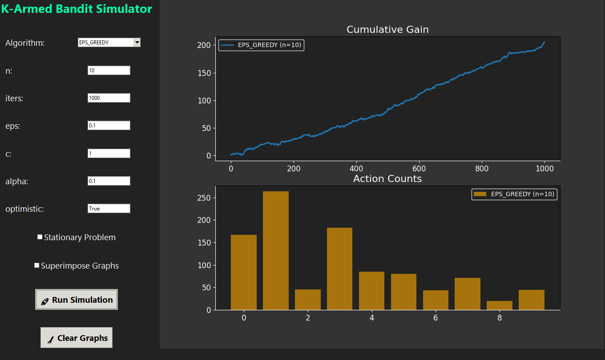

# 🎰 K-Armed Bandit Simulator

This project provides a **graphical interface** to experiment with different multi-armed bandit algorithms. It is built with **Python**, **Tkinter**, and **Matplotlib**, allowing you to visually explore how different strategies perform over time.

---

## Features

- **Algorithms Supported**:
  - Epsilon-Greedy (EPS_GREEDY)
  - Upper Confidence Bound (UCB)
  - Gradient Bandit

- **Customizable Parameters**:
  - Number of bandits (`n`)
  - Number of iterations (`iters`)
  - Epsilon (`eps`) for EPS_GREEDY
  - Confidence level (`c`) for UCB
  - Learning rate (`alpha`) for Gradient Bandit
  - Optimistic initialization

- **Additional Options**:
  - Toggle **stationary** vs. **non-stationary** bandit problems
  - **Superimpose** multiple simulations on the same graph
  - **Clear graphs** button to reset visualization

- **Visualizations**:
  - **Cumulative gain** over iterations
  - **Action counts** for each bandit
  - Display **true expected rewards** of each bandit

---
